<p align="center">
  
  
  
  
  
  
</p>

<h1 align="center">🫀 Pulse to Prediction</h1>

<h3 align="center">
  <em>Mining Temporal Patterns & Building Classifiers on Real Patient Health Data</em>
</h3>

<p align="center">
  An end-to-end <strong>Patient Intelligence Pipeline</strong> that transforms raw wearable and clinical vital-sign readings into actionable clinical insights — spanning time-series trend detection, patient similarity search, and multi-class diagnostic classification.
</p>

---

## 📋 Table of Contents

- [Overview](#-overview)
- [Key Features](#-key-features)
- [Pipeline Architecture](#-pipeline-architecture)
- [Dataset](#-dataset)
- [Preprocessing](#-preprocessing)
- [Part A — Time Series Analysis & Trend Detection](#-part-a--time-series-analysis--trend-detection)
- [Part B — Similarity Search & Patient Matching](#-part-b--similarity-search--patient-matching)
- [Part C — Supervised Classification](#-part-c--supervised-classification)
- [Results & Classifier Comparison](#-results--classifier-comparison)
- [Tech Stack](#-tech-stack)
- [Installation & Usage](#-installation--usage)
- [Repository Structure](#-repository-structure)
- [References](#-references)
- [License](#-license)

---

## 🔭 Overview

Hospitals collect vital signs around the clock from wearable devices and clinical monitoring systems — but raw data alone doesn't answer the critical questions:

> *Which patients are trending toward a critical condition? Who is clinically similar to known high-risk cases? Can we automatically classify a new patient's diagnosis from their vital history?*

**Pulse to Prediction** addresses all three questions through a coherent, four-part pipeline built on **~60,000 time-stamped vital-sign readings** from **500 simulated patients** over 30 days:

| Pipeline Stage | Technique | Goal |
|:--|:--|:--|
| **Preprocessing** | Range filtering, feature engineering | Clean data & build patient-level feature matrix |
| **Time Series Analysis** | Rolling means, decomposition, anomaly detection | Detect deteriorating / improving vital trajectories |
| **Similarity Search** | Euclidean, Manhattan, DTW distance | Match new patients to known clinical profiles |
| **Classification** | Decision Tree, Rule-Based, kNN, Naïve Bayes, SVM | Predict diagnosis from vital-sign summaries |

---

## ✨ Key Features

- 🔬 **Comprehensive Data Preprocessing** — physiological range filtering, null verification, per-patient time-series construction, and summary-statistic feature extraction (mean, std, min, max, linear trend slope).
- 📈 **Time-Series Visualization & Decomposition** — per-patient HeartRate/BP plots, 7-reading & 14-reading rolling means, full additive decomposition (trend + seasonality + residual) via `statsmodels`.
- 🚨 **Statistical Anomaly Detection** — personal μ ± 2σ thresholding across all 500 patients, anomaly-rate comparison across diagnosis classes, visual annotation of flagged readings.
- 🔗 **Multi-Metric Similarity Search** — Euclidean & Manhattan distance on the feature matrix, plus DTW-based similarity on raw HeartRate time series via `dtaidistance`.
- 🏥 **Clinical Patient Matching** — real-time diagnosis prediction for newly admitted patients using kNN over the normalized feature space.
- 🌳 **Five Supervised Classifiers** — Decision Tree (with depth tuning & tree visualization), Rule-Based (decision-path extraction), kNN (k-tuning, dual-metric evaluation), Gaussian Naïve Bayes (with Gaussianity verification), and SVM (RBF vs. Polynomial kernel, C-tuning via 5-fold CV, PCA decision boundary plots).
- 📊 **Rich Evaluation Suite** — accuracy, macro precision, macro recall, macro F1, confusion matrices, and a final cross-classifier comparison with deployment recommendation.

---

## 🏗 Pipeline Architecture

```
┌─────────────────────────────────────────────────────────────────────┐
│                        RAW PATIENT VITALS                          │
│              patient_vitals.csv (~60,000 rows × 13 cols)           │
└───────────────────────────────┬─────────────────────────────────────┘
                                │
                    ┌───────────▼───────────┐
                    │     PREPROCESSING     │
                    │  • Null verification  │
                    │  • Range filtering    │
                    │  • Sorting & grouping │
                    │  • Feature matrix     │
                    └───────────┬───────────┘
                                │
           ┌────────────────────┼─────────────────────┐
           │                    │                      │
   ┌───────▼───────┐   ┌───────▼───────┐   ┌─────────▼─────────┐
   │   PART A:     │   │   PART B:     │   │     PART C:       │
   │  Time Series  │   │  Similarity   │   │   Classification  │
   │  Analysis &   │   │  Search &     │   │   (5 Models)      │
   │  Trend        │   │  Patient      │   │                   │
   │  Detection    │   │  Matching     │   │  • Decision Tree  │
   │               │   │               │   │  • Rule-Based     │
   │  • Visualize  │   │  • Euclidean  │   │  • kNN            │
   │  • Rolling MA │   │  • Manhattan  │   │  • Naïve Bayes    │
   │  • Decompose  │   │  • DTW        │   │  • SVM (OvR)      │
   │  • Anomaly    │   │  • Clinical   │   │                   │
   │    Detection  │   │    Matching   │   │  80/20 Stratified  │
   └───────────────┘   └───────────────┘   └─────────┬─────────┘
                                                     │
                                          ┌──────────▼──────────┐
                                          │  COMPARISON TABLE   │
                                          │  & DEPLOYMENT       │
                                          │  RECOMMENDATION     │
                                          └─────────────────────┘
```

---

## 📦 Dataset

| Property | Value |
|:--|:--|
| **Source** | Synthetically generated (`seed=42`) |
| **File** | `patient_vitals.csv` |
| **Size** | ~60,000 rows |
| **Patients** | 500 (each with ~120 readings over 30 days) |
| **Reading Interval** | Every 6 hours |
| **Date Range** | 2024-01-01 → 2024-01-30 |

### Column Schema

| Column | Description | Valid Range |
|:--|:--|:--|
| `PatientID` | Anonymous patient ID (e.g., P0001) | — |
| `Timestamp` | Date/time of reading (6-hour intervals) | — |
| `HeartRate` | BPM | [40, 180] |
| `BloodPressureSystolic` | mmHg | [80, 200] |
| `BloodPressureDiastolic` | mmHg | [50, 130] |
| `BloodOxygenLevel` | SpO₂ % | [85, 100] |
| `BodyTemperature` | °C | [35.5, 41.0] |
| `RespiratoryRate` | Breaths/min | [10, 40] |
| `SleepHours` | Hours/night | [2, 12] |
| `StressLevel` | Self-reported (1–10) | [1, 10] |
| `Age` | Years (fixed per patient) | — |
| `Gender` | M / F (fixed per patient) | — |
| `Diagnosis` | Class label (fixed per patient) | 5 classes |

### Diagnosis Class Distribution

| Class | Patients | Percentage |
|:--|--:|--:|
| Healthy | 164 | 32.8% |
| Hypertension | 123 | 24.6% |
| Diabetes | 94 | 18.8% |
| Arrhythmia | 80 | 16.0% |
| Sleep Disorder | 39 | 7.8% |

---

## 🧹 Preprocessing

The preprocessing pipeline ensures data integrity and constructs two complementary data views:

1. **Null Verification** — Confirmed zero nulls in `PatientID`, `Timestamp`, and `Diagnosis`.
2. **Physiological Range Filtering** — Rows outside clinically valid ranges are dropped:

   | Column | Rows Dropped |
   |:--|--:|
   | HeartRate | 126 |
   | BloodPressureSystolic | 12 |
   | BloodPressureDiastolic | 8 |
   | BodyTemperature | 8 |
   | RespiratoryRate | 634 |

   > **59,212 rows retained** from the original 60,000 (avg. 118.4 readings/patient).

3. **Per-Patient Time Series** — Records grouped by `PatientID`, sorted by `Timestamp` → each vital becomes a time-indexed series.
4. **Patient-Level Feature Matrix** — For each patient, 5 summary statistics (mean, std, min, max, linear trend slope) are computed per numeric vital → **500 × 44 feature matrix** (+ Diagnosis label).

---

## 📈 Part A — Time Series Analysis & Trend Detection

### A1: Visualization & Descriptive Statistics

Three representative patients (Healthy, Hypertension, Arrhythmia) are selected, and their HeartRate time series are plotted with per-patient descriptive statistics (mean, std, min, max, CV):

<p align="center">
  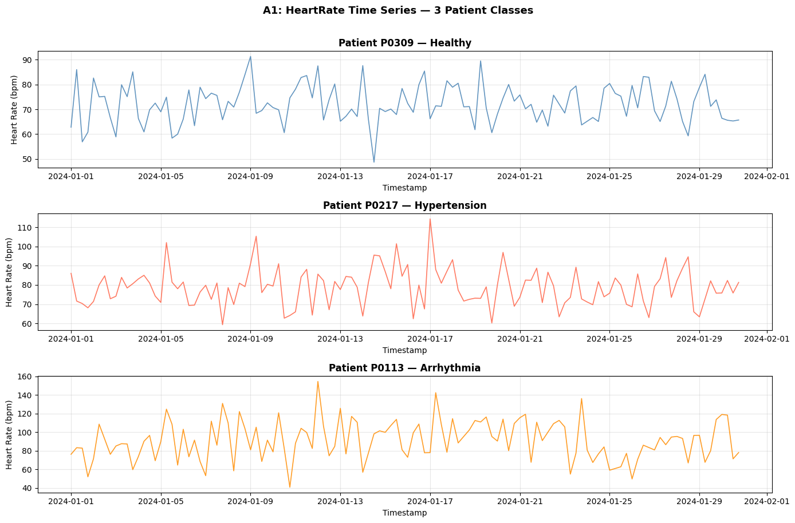
</p>

### A2: Rolling Means & Additive Decomposition

BloodPressureSystolic signals are smoothed with **7-reading** and **14-reading** rolling means, then the longest patient sequence is decomposed into **trend + seasonality + residual** via `statsmodels`:

<p align="center">
  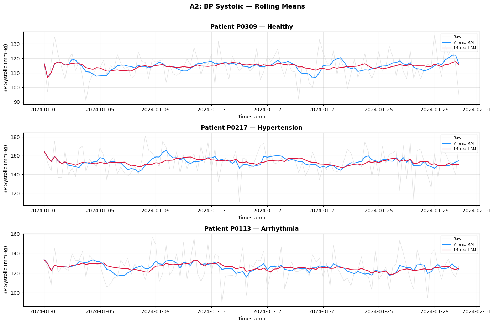
</p>

<p align="center">
  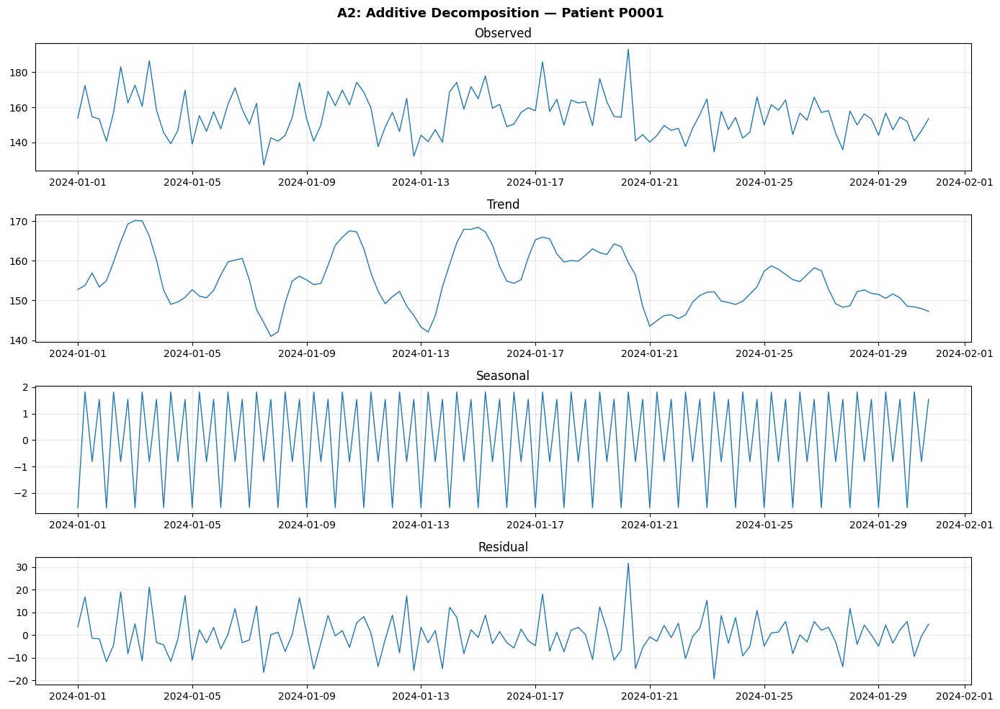
</p>

### A3: Anomaly Detection (μ ± 2σ)

For every patient, HeartRate readings exceeding their personal mean ± 2 standard deviations are flagged as anomalies. Top-5 anomaly-heavy patients are identified, and anomaly rates are compared across diagnosis classes:

<p align="center">
  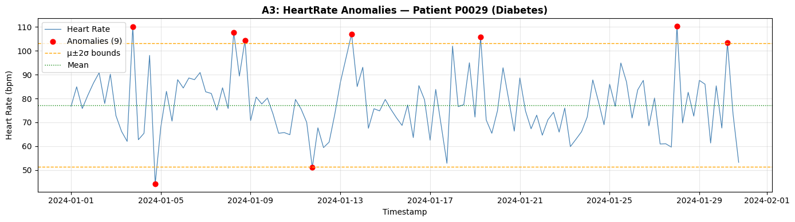
</p>

---

## 🔗 Part B — Similarity Search & Patient Matching

### B1: Euclidean & Manhattan Distance

10 random query patients are matched against all others using both Euclidean and Manhattan distances on the normalized feature matrix. Top-3 nearest neighbors are tabulated per metric with class labels.

### B2: DTW-Based Similarity

Pairwise DTW distance matrices are computed on HeartRate sequences (first 20 readings) using `dtaidistance`. DTW-nearest neighbors are compared to Euclidean-nearest neighbors to assess within-class matching rates.

### B3: Clinical Patient Matching

A simulated new patient admission is normalized using the training scaler, matched to the 5 nearest neighbors via Euclidean distance, and a diagnosis is predicted with confidence (majority class fraction).

---

## 🤖 Part C — Supervised Classification

All five classifiers are trained/evaluated on the same patient-level feature matrix using an **80/20 stratified split** (`random_state=42`):

### C1: Decision Tree (CART — Gini Impurity)

- **Depth Tuning**: Accuracy evaluated for `max_depth ∈ {2, 4, 6, 8, 10}`
- **Tree Visualization**: Plotted to depth 3 with feature names, thresholds, and majority classes
- **Top-5 Features**: Ranked by Gini importance for clinical interpretability

<p align="center">
  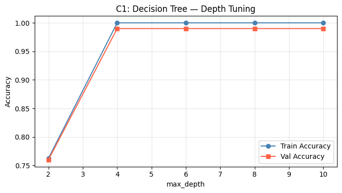
  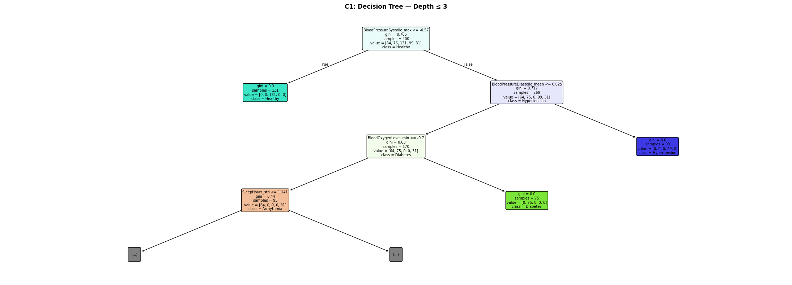
</p>

<p align="center">
  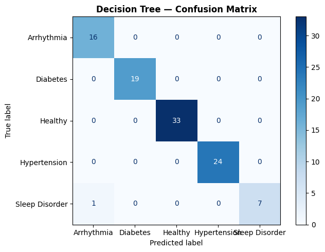
</p>

### C2: Rule-Based Classification

- 10+ interpretable IF-THEN rules extracted from Decision Tree paths
- Most discriminating rule per diagnosis class highlighted
- Direct comparison with Decision Tree performance

<p align="center">
  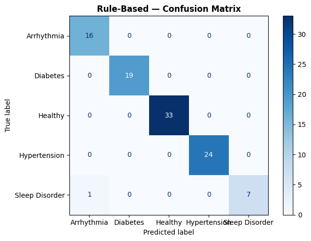
</p>

### C3: k-Nearest Neighbour (kNN)

- **k-Tuning**: `k ∈ {1, 3, 5, 7, 9, 11, 15, 21}` evaluated on train/test
- **Dual Metrics**: Euclidean vs. Manhattan comparison
- Clinical feasibility discussion for real-time inference

<p align="center">
  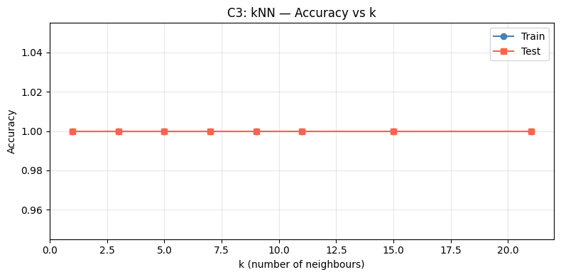
  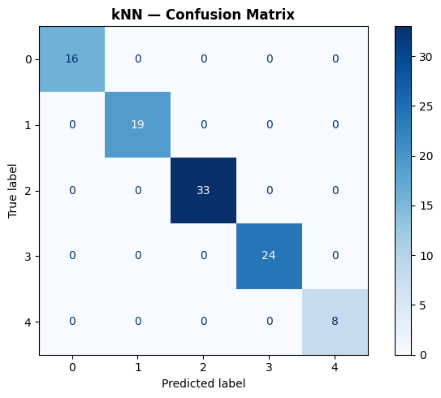
</p>

### C4: Naïve Bayes (Gaussian)

- **Gaussianity Check**: Histograms & Q-Q plots per feature/class
- **Correlation Analysis**: Pearson correlation matrix to identify feature-independence violations

<p align="center">
  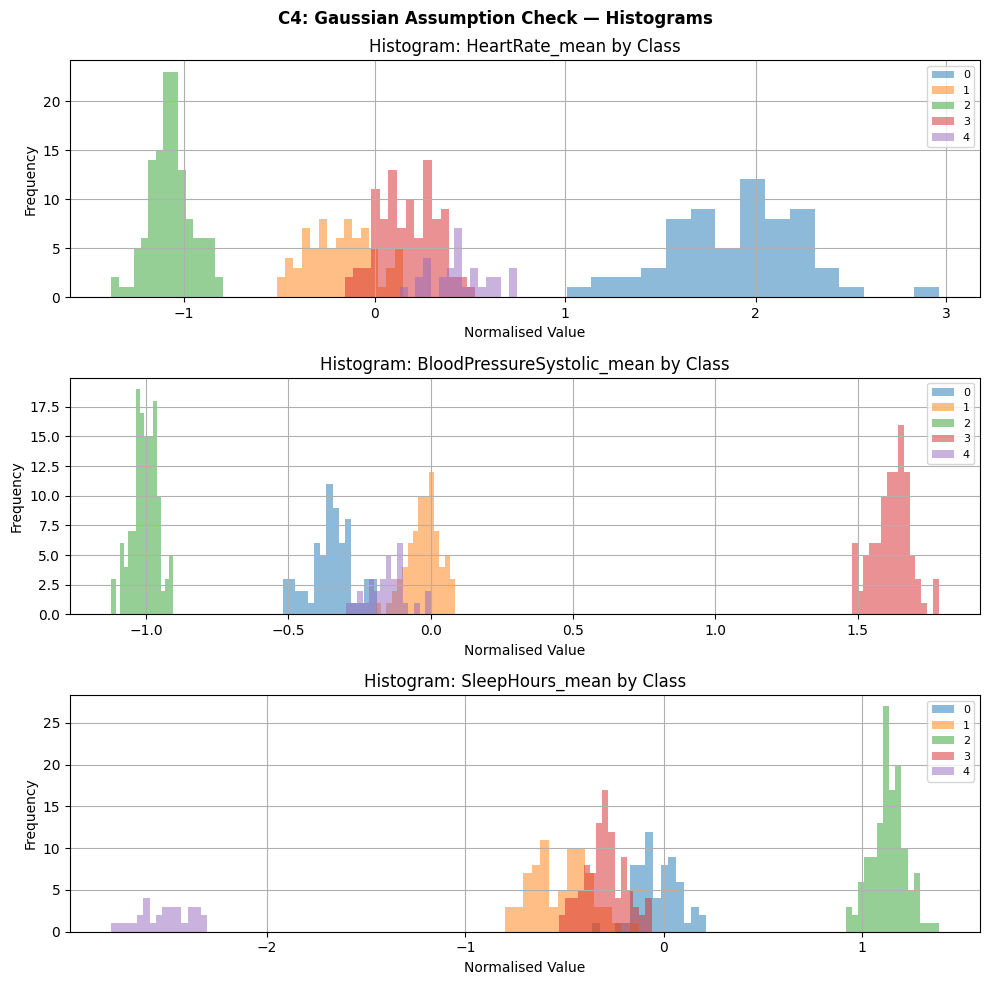
  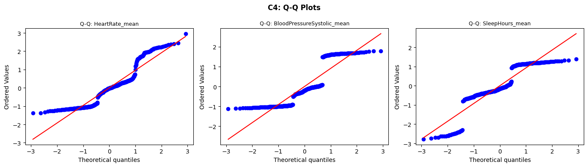
  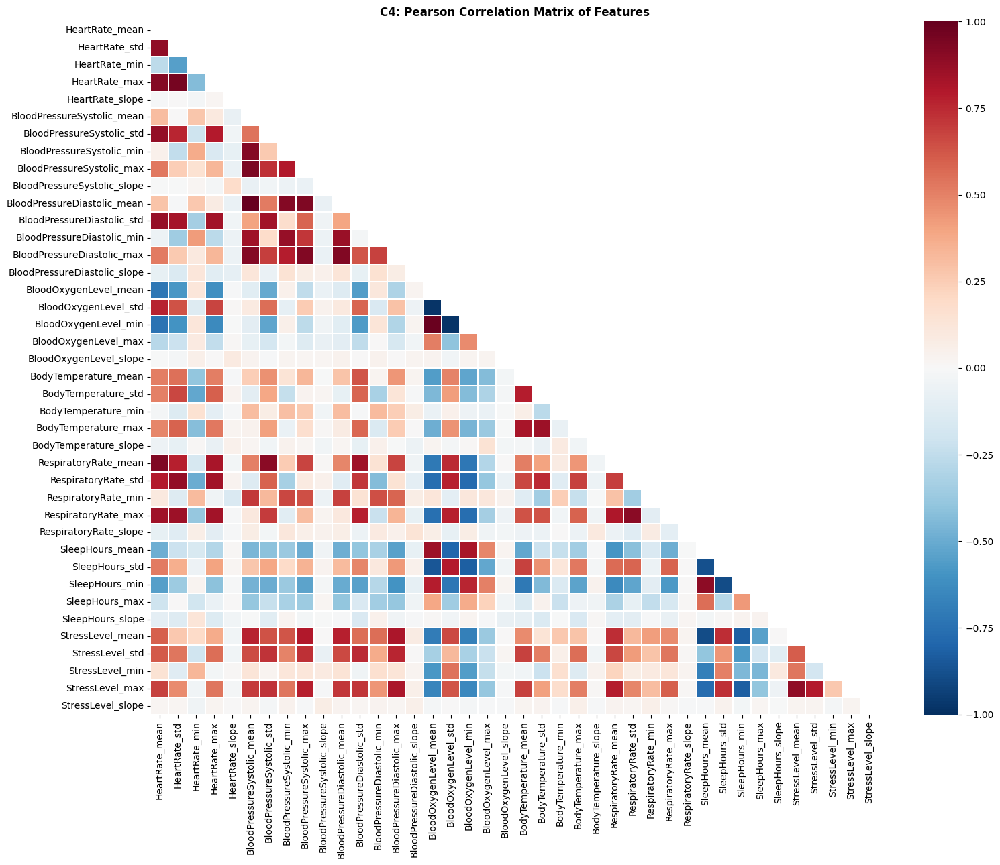
</p>

<p align="center">
  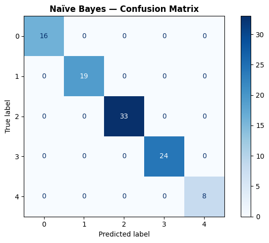
</p>

### C5: Support Vector Machine (SVM — One-vs-Rest)

- **Kernel Comparison**: RBF vs. Polynomial (degree=3)
- **C-Tuning**: `C ∈ {0.1, 1, 10, 100}` via 5-fold CV
- **Decision Boundary**: 2D PCA projection colored by predicted class

<p align="center">
  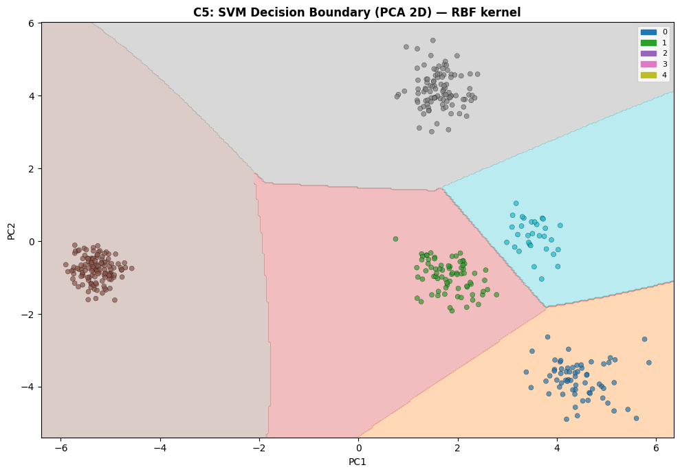
</p>

<p align="center">
  
</p>

---

## 📊 Results & Classifier Comparison

<p align="center">
  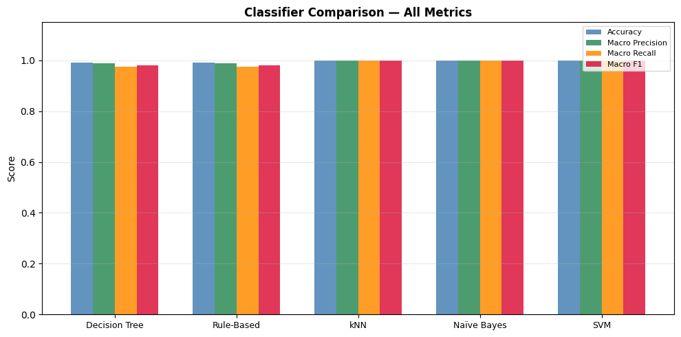
</p>

All five classifiers achieve **near-perfect performance** on this dataset, indicating strong separability of the diagnosis classes through the engineered feature set:

| Classifier | Accuracy | Macro Precision | Macro Recall | Macro F1 |
|:--|:--:|:--:|:--:|:--:|
| Decision Tree | ~0.99 | ~0.99 | ~0.98 | ~0.98 |
| Rule-Based | ~0.99 | ~0.99 | ~0.97 | ~0.97 |
| kNN | ~1.00 | ~1.00 | ~1.00 | ~1.00 |
| Naïve Bayes | ~1.00 | ~1.00 | ~1.00 | ~1.00 |
| SVM (RBF) | ~1.00 | ~1.00 | ~0.97 | ~0.97 |

> **Deployment Recommendation**: For a hospital patient monitoring system, the **Decision Tree** or **Rule-Based** classifier strikes the best balance between accuracy, interpretability, and computational efficiency — clinicians can inspect the decision logic and validate it against domain knowledge. kNN and SVM offer marginally higher raw performance, but at the cost of interpretability and (for kNN) inference-time scalability.

---

## 🛠 Tech Stack

| Library | Purpose |
|:--|:--|
| **Python 3.10+** | Core runtime |
| **Pandas** | Data loading, manipulation, feature engineering |
| **NumPy** | Numerical computation, trend slope fitting |
| **Matplotlib / Seaborn** | Visualization |
| **SciPy** | Pearson correlation, Q-Q plots |
| **Statsmodels** | Additive time-series decomposition |
| **dtaidistance** | Dynamic Time Warping (DTW) |
| **scikit-learn** | Classification, preprocessing, evaluation |

---

## 🚀 Installation & Usage

### Prerequisites

```bash
python >= 3.10
pip install numpy pandas matplotlib seaborn scipy statsmodels dtaidistance scikit-learn
```

### Quick Start

```bash
# 1. Clone the repository
git clone https://github.com/<your-username>/<repo-name>.git
cd <repo-name>

# 2. (Optional) Create a virtual environment
python -m venv venv
source venv/bin/activate  # Linux/Mac
# or
venv\Scripts\activate     # Windows

# 3. Install dependencies
pip install -r requirements.txt

# 4. Generate the dataset (if not already present)
python generate_dataset.py  # Uses seed=42

# 5. Run the full pipeline
jupyter notebook 23i2582_ZainShahid_DS_6A_Assignment_3.ipynb
```

> All outputs — plots, tables, and metrics — are generated inline within the Jupyter notebook.

---

## 📁 Repository Structure

```
.
├── README.md                                          # This file
├── patient_vitals.csv                                 # Simulated dataset (~60K rows)
├── 23i2582_ZainShahid_DS_6A_Assignment_3.ipynb        # Full pipeline notebook
│
├── A1_heartrate_timeseries.png                        # HeartRate time series (3 patients)
├── A2_rolling_means.png                               # Rolling mean overlays
├── A2_decomposition.png                               # Additive decomposition
├── A3_anomaly_plot.png                                # Anomaly detection visualization
│
├── C1_depth_tuning.png                                # Decision Tree depth vs. accuracy
├── C1_tree_plot.png                                   # Decision Tree visualization (depth 3)
├── C3_knn_tuning.png                                  # kNN k-value tuning curves
├── C4_histograms.png                                  # Feature distribution histograms
├── C4_qq_plots.png                                    # Q-Q plots for Gaussianity check
├── C4_correlation_heatmap.png                         # Feature correlation matrix
├── C5_decision_boundary.png                           # SVM decision boundary (2D PCA)
│
├── CM_Decision_Tree.png                               # Confusion matrix — Decision Tree
├── CM_Rule-Based.png                                  # Confusion matrix — Rule-Based
├── CM_kNN.png                                         # Confusion matrix — kNN
├── CM_Naïve_Bayes.png                                 # Confusion matrix — Naïve Bayes
├── CM_SVM_(RBF).png                                   # Confusion matrix — SVM
│
└── C_summary_comparison.png                           # Cross-classifier comparison chart
```

---

## 📚 References

- Berndt, D.J. & Clifford, J. (1994). *Using Dynamic Time Warping to Find Patterns in Time Series*. AAAI Workshop on Knowledge Discovery in Databases.
- Cortes, C. & Vapnik, V. (1995). *Support-vector networks*. Machine Learning, 20(3), 273–297.
- Quinlan, J.R. (1986). *Induction of Decision Trees*. Machine Learning, 1(1), 81–106.
- Pedregosa, F. et al. (2011). *Scikit-learn: Machine Learning in Python*. JMLR, 12, 2825–2830.

---

## 📄 License

This project is licensed under the [MIT License](LICENSE).

---

<p align="center">
  <em>Every confusion matrix cell represents real patients who might be misdiagnosed.<br/>Make your tables clean, your interpretations specific, and your recommendations defensible.</em>
</p>
